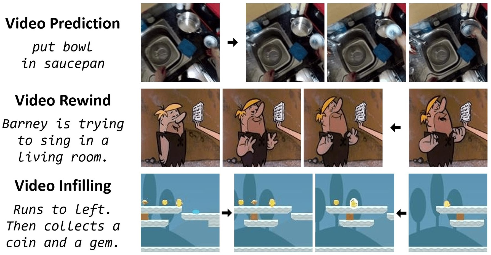
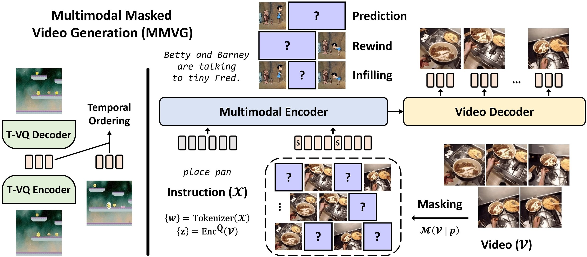

# Tell Me What Happened: Unifying Text-guided Video Completion via Multimodal Masked Video Generation
A PyTorch implementation of [TVC](https://tsujuifu.github.io/pubs/arxiv_tvc.pdf)



## Overview
TVC is an implementation of <br>
"[Tell Me What Happened: Unifying Text-guided Video Completion via Multimodal Masked Video Generation](https://tsujuifu.github.io/pubs/arxiv_tvc.pdf)"
[Tsu-Jui Fu](https://tsujuifu.github.io), [Licheng Yu](https://lichengunc.github.io), [Ning Zhang](https://n-zhang.github.io), [Cheng-Yang Fu](https://www.cs.unc.edu/~cyfu), [Jong-Chyi Su](https://people.cs.umass.edu/~jcsu), [William Yang Wang](https://sites.cs.ucsb.edu/~william), and [Sean Bell](https://scholar.google.com/citations?user=xY1GdVgAAAAJ)



## Requirements
This code is implemented under **Python 3.9**, [Torch 1.11](https://pypi.org/project/torch/1.11.0), [Torchvision 0.12](https://pypi.org/project/torchvision/0.12.0), [TorchMetrics 0.6](https://pypi.org/project/torchmetrics/0.6.0), and [Lightning 1.3](https://pypi.org/project/pytorch-lightning/1.3.0). <br>
+ [OmegaConf](https://pypi.org/project/omegaconf), [tqdm](https://pypi.org/project/tqdm)
+ [CLIP](https://github.com/openai/CLIP), [Transformers](https://pypi.org/project/transformers)
+ [Taming](https://github.com/CompVis/taming-transformers)

We simplify the implementation and adopt [VideoGPT](https://github.com/wilson1yan/VideoGPT) in our MMVG.

## Usage
Put [ckpt](https://drive.google.com/drive/folders/1xkb8-j_Rtjth5e0c5akO2hMu-xDnARv7) in [./\_ckpt](https://github.com/tsujuifu/pytorch_tvc/tree/main/_ckpt)
### Inference
```
inference.ipynb
```

## Citation
```
@inproceedings{fu2022tvc, 
  author = {Tsu-Jui Fu and Licheng Yu and Ning Zhang and Cheng-Yang Fu and Jong-Chyi Su and William Yang Wang and Sean Bell}, 
  title = {Tell Me What Happened: Unifying Text-guided Video Completion via Multimodal Masked Video Generation}, 
  booktitle = {arXiv:2211.12824}, 
  year = {2022}
}
```

## Acknowledgement
This code is based on [Taming](https://github.com/CompVis/taming-transformers) and [TATS](https://github.com/SongweiGe/TATS)
